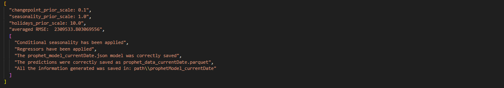

 %5D.usos&label=usos%20en%20proyecto&labelColor=1A3B47)      

    
    

     

## Aplicaciones

Las aplicaciones que este acelerador ha impulsado son pronósticos de series temporales.

## **Casos de uso particulares**

{width=30 height=30} **Pronóstico de ventas especiales** 

{width=30 height=30} **Analítica predictiva de activos estratégicos**

# Pronóstico de series temporales

No solo se presenta la estimación de series temporales con tres metodologías distintas: Facebook prophet, SARIMAX y redes LSTM, sino también su uso mediante una aplicación construída con FastAPI dentro de un contenedor Docker.

Además se expone el uso del servicio AWS Forecast.

### Facebook prophet

Originalmente se tiene como supuesto el hecho de que existe una herramienta creada por _Facebook_ para aquellos casos donde el enfoque ARIMA no se puede manejar debido a la estacionariedad y al pronóstico a largo plazo, la cual está basada en codificación probabilística, lo que permite tener ventajas bayesianas sobre los datos, por ejemplo, la estacionalidad.

Fundamentalmente, _Facebook prophet_ fue diseñado para pronosticar conjuntos de datos comerciales, esto es, fue específicamente creado para conjuntos de datos con frecuencia muy alta en el tiempo, por ejemplo, frecuencia diaria o por minuto y teniendo muchos registros; además de la capacidad de modelar días especiales, conocidos como holidays, en los cuales la serie se ve alterada. Incluso puede operar de manera efectiva si el conjunto de datos tiene numerosos valores atípicos, si las tasas de crecimiento son cambiantes y si el horizonte de pronóstico es a largo plazo.

La base de este enfoque es el análisis de series de tiempo de Fourier en donde se descompone la serie objetivo para comprender tanto su comportamiento como el impacto de la interacción entre los siguientes componentes:

+ **la tendencia** de la serie normalizada a lo largo del tiempo
+ **la estacionalidad** que corresponde a patrones periódicos
+ el ajuste a partir del impacto de los **esfuerzos comerciales** o festividades
+ **los residuales** que ayudana medir el error en la estimación

    

### SARIMAX

Ciertamente existen distintas metodologías para pronosticar según el tipo de información con la que se cuente, lo que se necesite analizar o cómo se quiere abordar el problema. SARIMAX son un conjunto de modelos populares por su éxito en la **predicción a corto plazo**, los cuales además tratan de realizar previsiones utilizando únicamente como información la contenida en los valores pasados de la propia serie temporal, dando la opción de _agregar una variable externa_ diferente para ayudar a medir la variable objetivo o endógena.

### Redes neuronales recurrentes LSTM o Long Short Term Memory 

Las redes neuronales artificiales son adecuadas para muchas tareas de reconocimiento de patrones y aprendizaje automático, es por esta razón que se ha buscado una aproximación en series temporales, tanto univariadas como con variables exógenas. Sin embargo, se debe tener en cuenta que no hay un método establecido para definir la red, el número de neuronas y/o de capas, por lo que la mayoría de la veces las estimaciones se basan en definir modelos a prueba y error.

## Benchmark
[:arrow_up:](#toc)

Como se ha mencionado arriba, el propósito de este repositorio es mostrar tres de las técnicas/herramientas más populares que se utilizan actualmente para pronósticar una serie de tiempo. Si bien los resultados de cada modelo dependerán del caso de uso a tratar a continuación se muestra una aproximación que ayudará a evaluar su desempeño:

* Se trata una serie temporal de ventas diarias de un negocio
* Se observa estacionalidad semanal, lo cual sugiere que en fines de semana la venta es mayor
* Se tienen 2 años 8 meses de información histórica
* Se toma el 30% de los registros como conjunto de validación

   
   

 Prophet presenta menos RMSE

   
   

 SARIMAX define un mejor modelo, según la medida de error

   

   

 Precisión de cada modelo

| SARIMAX | Prophet| Redes LSTM |
|------------------------|------------------------|------------------------|
|Es el proceso clásico y *llega* a ser muy bueno para grandes rangos de tiempo|Capacidad de modelar días especiales en los cuales la serie se ve alterada | Suele ser complicado construir la red, es decir, hallar la dimensión óptima para lograr buenos resultados |
|Según el comportamiento de los datos, **encontrar y construir** ‘las mejores’ **variables exógenas** que logren capturar el comportamiento **puede ser tardado.** | La construcción de regresores y estacionalidades condicionales ayuda a capturar mejor el comportamiento de los datos (exógenas). Las variables regresoras distribuyen su peso de manera uniforme sobre las fechas sobre las cuales esté definida| A diferencia de ARIMA o Prophet, no se basan en suposiciones específicas sobre los datos, como la estacionariedad de series temporales o la existencia patrones|
|Suele ser mejor que otros procesos cuando se tiene muy poca información histórica|Diseñado específicamente para tratar series temporales de negocios, i.e. aquellas con frecuencia alta y con muchos registros
|Cada que se ajuste un modelo es importante observar y **tratar los valores extremos**| Puede operar de manera efectiva si el conjunto de datos tiene numerosos valores atípicos

En resumen:

    

## Escalabilidad
[:arrow_up:](#toc)

La solución implementada en nube mejora no solo la precisión de pronósticos de series temporales, sino que también los produce automáticamente y genera paneles de visualización, ofreciendo una interaz rápida.

### Beneficios

* Facilitar el proceso de ingesta, modelado y pronóstico 
* Monitorizar los pronósticos de manera sencilla enviando correos electrónicos a los usuarios cuando ocurran éxitos o fallos
* Facilitar el análisis al combinar los datos de entrada y los resultados del pronóstico en un Análisis de Amazon QuickSight o en un Jupyter Notebook de Amazon SageMaker

**Claramente, según el caso de uso y recursos sobre los cuales un proyecto se desarrolle se pueden adecuar los servicios.** 

A continuación se presentan tres posibles arquitecturas. Cabe mencionar que en ninguna se genera una notificación de evento de Amazon S3 mediante AWS Lambda que se invoque cuando se carguen nuevos conjuntos de datos al inicio del proceso, esto debido a que **este activo se tiene pensado para pronósticos generados cada cierto tiempo, no de manera recurrente 1 aún si los datos se actualizan con mayor frecuencia.**

<strong>Comparativa de arquitecturas</strong>

    
    
    

    
    
    
    

Propuestas y sus costos para endpoints de pronósticos de series temporales con AWS EC2, AWS Forecast y AWS SageMaker, respectivamente.

2 El nivel gratuito de AWS (AWS Free Tier) te permite tener un límite mensual de hasta 10,000 pronósticos de series temporales, hasta 10 GB de almacenamiento y hasta 10 horas de tiempo de entrenamiento. El nivel gratuito de Amazon Forecast es válido durante los primeros dos meses de uso.

3 La tabla de Amazon Athena que representa la salida de pronósticos combinados está limitada al tamaño acumulativo máximo de todos los archivos en Amazon S3 (actualmente 30 GB para conjuntos de datos de Amazon Forecast).

Las tres arquitecturas expuestas muestran **mayor resiliencia** ya que están basadas en las mejores prácticas de AWS, en las cuales por segurdidad y fiabilidad se sugiere el uso no solo de una única zona de disponibilidad. Además, proponen el uso servicios como AWS QucikSight y Athena para realizar tanto consultas como análisis de las predicciones y obtener visualizaciones. A continuación se presentan propuestas generales.

<strong>Comparativa de arquitecturas según la frecuencia de eventos</strong>

    
    

| Arquitectura basada en trigger manual | Arquitectura basada en trigger automático|
|------------------------|------------------------|
| Para casos en los cuales el pronóstico no se realiza de manera frecuente             | Diseñada para ejecutarse cada que se detecte nueva información             |
|1. Obtención de los datos tanto manuales, de otras nubes o de AWS Redshift, esto se guardarán en un bucket de S3: Raw              | 1. **Amazon S3** para almacenar la información manual que se encuentre fuera de la nube y uso de RedShift como dataWarehouse              |
| 2. AWS Step Functions que combina una serie de funciones definidas mediante Jobs de Glue, las cuales limpian la información, entrenan e implementan los modelos            | 2. Una **notificación de evento de Amazon S3** que se invoca cuando se cargan nuevos conjuntos de datos en el bucket o en el datawarehouse relacioando             |
| 3. Trigger manual que permitirá ejecutar los procesos definidos en **Glue Jobs**             | 3. **AWS Step Functions** que combina una serie de funciones definidas mediante **Jobs de Glue**, las cuales entrenan e implementan los modelos. Todas las funciones de AWS Step Functions se registran en **CloudWatch**              |
| 4. Todas las acciones de AWS Step Functions se registran en CloudWatch              | 4. Una suscripción por correo electrónico a **AWS Simple Notification Service** que notifica a los usuarios los resultados de AWS Step Functions.              |
| 5. Buckets de S3 para concentrar los datos de las distintas fuentes (ver 1), para almacenar los datos preprocesados y los resultados finales |5. Buckets de S3 para almacenar el preprocesamiento como los resultados pronosticados|

    
    

## Contenedor

Para la ejecución de la aplicación con Docker primero se debe crear una imagen con la sentencia `docker build -t nombre_de_la_imagen .`, siempre usando el ambiente virtual que contenga los requerimientos necesarios (api_requirements.txt), y mediante `docker run -p 8000:8000 -t -i nombre_de_la_imagen` Docker ejecuta un contenedor basado en la imagen *nombre_de_la_imagen* creada desde el puerto interno 8000 al puerto externo 8000. Finalmente se ingresa `http://localhost:8000/docs` en el explorador.

## API

La aplicación creada mediante FastAPI que se ejecuta con Docker fue desarrollada en los scripts *main* y *service* que se encuentran en *src*. En ellos se definen los siguientes métodos según el tipo de modelo a aplicar y cuentan con la opción de cargar información no solo cuando ésta se encuentra en local sino también cuando se encuentra en buckets de S3.

### Facebook prophet

Generación de predicciones basadas en la librería de Facebook

1. **prophet_model()** mediante validación cruzada busca los **mejores hiperparámetros** para el modelo y los devuelve. Además, guarda el **dataframe con las predicciones generadas** en la ruta especificada, el **modelo en formato .json y los gráficos de estimación y descomposición de la serie** dado el horizonte de pronóstico que se especifique

2. **train_prophet()** construye **el mejor modelo y lo guarda como .json** en una ruta dada. Al igual que en *prophet_model()* **muestra un mensaje con los mejores hiperparámetros** encontrados mediante validación cruzada

3. **test_prophet()** es el complemento de *train_prophet()* ya que permite obtener las **predicciones** basadas en un modelo que se pasa como parámetro. Dichos resultados son guardados como **parquet** en la ruta especificada, también los **gráficos de descomposición y estimación de la serie**

Ejemplo de mensajes de salida si ningún error fue generado. Se muestran las especificaciones sobre las que el modelo fue entrenado.

### SARIMAX

Funciones que ayudan y orientan al experto en la toma de decisiones para seleccionar el modelo SARIMAX que considere más conveniente. Cabe mencionar que ésta metodología suele ser más demandante dada la atención estadística que requiere al momento de verificar el cumplimiento de los supuestos sobre los cuales se desarrolla, por lo que se conoce como iterativa:

1. **season_periodogram()** devuelve un **mensaje con el valor del periodo** (estacionalidad) de una serie temporal en caso de que sea díficil identificar

2. **sarimax_order()** crea una carpeta llamada *sarimaxOrder_{YYYY-mm-dd}* en donde se guarda el **gráfico de la serie objetivo y los autocorrelogramas de la versión estacionaria** de la misma. Además, como mensaje devuelve el **orden de las diferencias** tanto de la parte regular -d- como de la estacional -D-, ésta la última en caso de que se identifique componente estacional

3. **best_sarimax()** gracias a los autocorrelogramas obtenidos en *sarimax_order()* se puede definir un punto de partida para comenzar a iterar sobre los argumentos que recibe ésta función ya que con base en Box-Jenkins se imprime una **lista con los posibles modelos de estimación a corto plazo**, esto es, aquellos que cumplen que todos sus coeficientes son significativamente distintos de cero. De dicha lista el experto puede seleccionar el modelo que mejor considere y comenzar el análisis de residuales, también puede analizar los **gráficos generados** en la carpeta *bestSarimax_{YYYY-mm-dd}*. Por cada modelo se generan tres plots pues mediante 3-fold cross validation es cómo se obtienen las métricas, como RMSE, que ayudan a tomar decisiones

4. **rolling_best_sarimax()** funciona de manera similar a *best_sarimax()*, pero en este caso para realizar la validación cruzada se toma observación por observación, es decir, con el conjunto de entrenamiento pronostica un solo valor, después dicho valor pasa a ser parte del entrenamiento y vuelve a pronósticar la siguiente observación, es por esto que es más tardado y costoso computacionalmente. 

5. en **residuals()** una vez seleccionados los órdenes del modelo, se analizan los residuales del mismo para verificar que los supuestos se satisfacen (homocedasticidad, independencia, estacionariedad y normalidad), de no ser así, se tiene que elegir otro modelo que sí los cumpla. Por ello, se muestra un **mensaje que indica si las hipótesis se han cumplido** y en la carpeta *residuals_{YYYY-mm-dd}* se guardan **los autocorrelogramas** para identificar correlación de manera gráfica y un **qqplot** para normalidad

6. cuando ya se tenga un modelo final con los requerimientos necesarios, se puede estimar una predicción a corto plazo, **forecast_SARIMAX()** permite obtener no solo las estimaciones sino también sus bandas de confianza al 1-&alpha; %, guardando los **resultados en formato .parquet y de manera gráfica** en una carpeta llamada *sarimaxForecasting_{YYYY-mm-dd}*

### Redes neuronales recurrentes LSTM o Long Short Term Memory 

Existen dos scripts según el caso de uso sobre el cual se necesite trabajar:

1. Dentro de *src -> models -> rnn_univariate_model* **univariate_rnn_model()** es la función para obtener las predicciones de una serie temporal univariante mediante redes neuronales recurrentes. En la carpeta *univariateRNN_{YYYY-mm-dd}* guarda el **modelo en formato .h5, los pronósticos en formato .parquet y tres gráficos con la serie objetivo, la función de pérdida y las predicciones**, respectivamente.

2. Dentro de *src -> models -> rnn_multivariate_model* **multivariate_rnn_model()** realiza y guarda los resultados en el mismo formato que el anterior, pero aplicado a modelos que requieran variables exógenas

> Cuando se quiera ejecutar sin el uso de Docker basta correr la sentencia `uvicorn src.service:app --reload` dentro del ambiente virtual creado y abrir el explorador en `http://localhost:8000/docs`, esto mostrará la siguiente interfaz de usuario creada con Swagger: 

   
   

 La documentación se explica en los esquemas (izquierda). El botón <strong> try it out </strong> permite usar las funciones (derecha)

También se puede entrar a `http://localhost:8000/redoc` en el explorador y con **try** ejecutar las pruebas necesarias:

Cuando los parámetros requeridos sean rutas, éstas deben ser escritas con diagonales invertidas para separar los directorios, ya sea `\` o `\\`, según el caso.

En caso de que se utilice Docker para su ejecución primero se debe crear una imagen con la sentencia `docker build -t nombre_de_la_imagen .`, siempre usando el ambiente virtual que contenga los requerimientos necesarios (api_requirements.txt), y mediante `docker run -p 8000:8000 -t -i nombre_de_la_imagen` Docker ejecuta un contenedor basado en la imagen *nombre_de_la_imagen* creada desde el puerto interno 8000 al puerto externo 8000. Finalmente se ingresa `http://localhost:8000/docs` en el explorador.

Organización
------------

    ├── Makefile                    <- Makefile with commands like `make data` or `make train`
    ├── README.md                   <- The top-level README for developers using this project.
    |
    ├── data                        <- Included in the .gitignore file for security of data
    │   ├── external                <- Data from third party sources.
    │   ├── interim                 <- Intermediate data that has been transformed.
    │   ├── processed               <- The final, canonical data sets for modeling.
    │   └── raw                     <- The original, immutable data dump.
    │
    ├── docs                        <- A default Sphinx project; see sphinx-doc.org for details
    │
    ├── models                      <- Trained and serialized models, model predictions, or model summaries
    │
    ├── notebooks                   <- Jupyter notebooks. Naming convention is a number (for ordering),
    │                               the creator's initials, and a short `-` delimited description, e.g.
    │                               `1.0-jqp-initial-data-exploration`.
    │
    ├── references                  <- Data dictionaries, manuals, and all other explanatory materials.
    │
    ├── reports                     <- Generated analysis as HTML, PDF, LaTeX, etc.
    │   └── figures                     <- Generated graphics and figures to be used in reporting
    │
    ├── project_requirements.txt    <- The requirements file for reproducing the project environment, that means
    |                               not using fastAPI, e.g. generated with `pip freeze > project_requirements.txt`
    |
    ├── api_requirements.txt        <- The requirements file for reproducing the api environment using fastAPI
    │
    ├── setup.py                    <- makes project pip installable (pip install -e .) so src can be imported
    ├── src                         <- Source code for use in this project.
    │   ├── main.py                 <- Functions definition for fastAPI
    |   ├── service.py              <- API structure definition
    |   ├── get_custom_redoc_html.py   <- redoc documentation structure definition
    │   │
    │   ├── data                    <- Scripts to download or generate data
    │   │   └── make_dataset.py
    │   │
    │   ├── features                <- Scripts to turn raw data into features for modeling
    │   │   └── build_features.py
    │   │
    │   ├── models                  <- Scripts to train models and then use trained models to make
    │   │                           predictions
    │   │
    │   └── utils                   <- Scripts to define other functions for help
    │           ├── aws_s3.py       <- Upload a file to an S3 bucket
    |           ├── fcs_util.py     <- Functions used with AWSForecast
    |           ├── reg.py          <- Functions to define regresors in prophet models, if required    
    │           └── season.py       <- Functions to define conditional seasonality in prophet models, if required 
    |           
    └── Dockerfile                  <- Commands to assemble a docker image

--------

<small>Project based on the <a target="_blank" href="https://drivendata.github.io/cookiecutter-data-science/">cookiecutter data science project template</a>. #cookiecutterdatascience</small>

